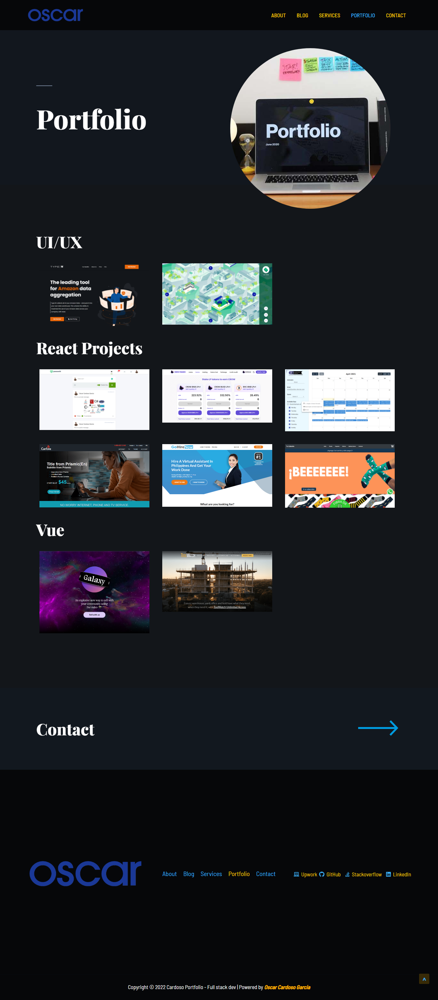

### Hi there 👋

    

You can visit my portfolio site for get more detail about me.

<!--
**Cardoso-topdev/Cardoso-topdev** is a ✨ _special_ ✨ repository because its `README.md` (this file) appears on your GitHub profile.

Here are some ideas to get you started:

- 🔭 I’m currently working on ...
- 🌱 I’m currently learning ... 
- 👯 I’m looking to collaborate on ... 
- 🤔 I’m looking for help with ... 
- 💬 Ask me about ...
- 📫 How to reach me: ...
- 😄 Pronouns: ...
- ⚡ Fun fact: ... 
-->

  

